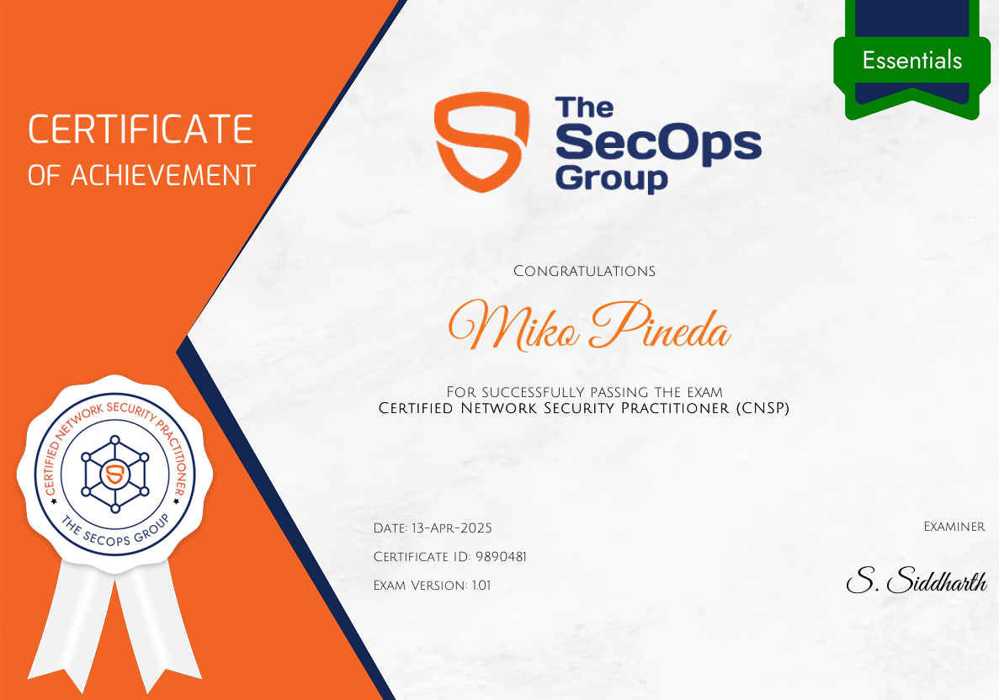
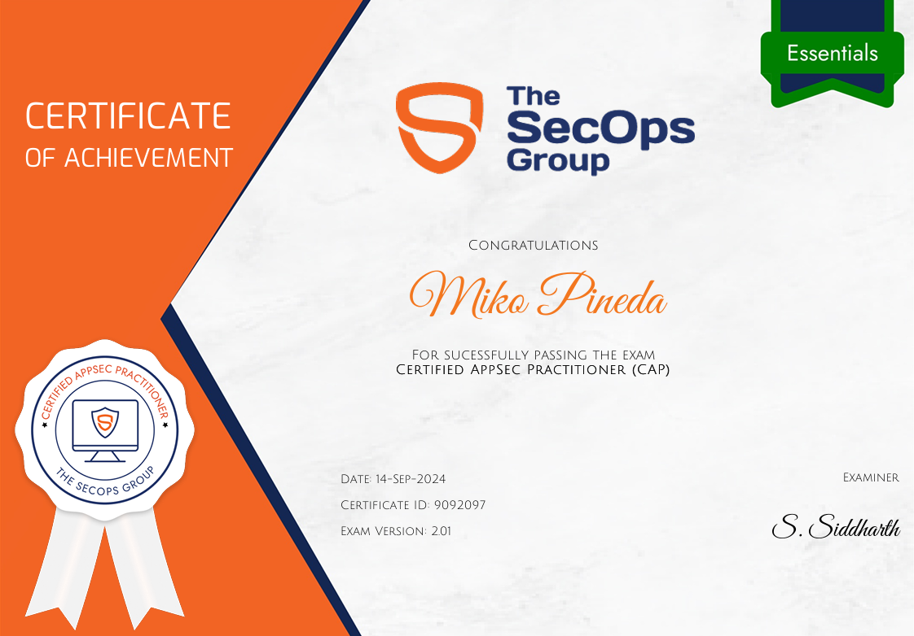

# The SecOps Group

Hey there! Here’s a quick look at some of the certifications I’ve earned as I continue building my skills in cybersecurity — starting with a few from [The SecOps Group](https://secops.group/).

***

## Certified Network Security Practitioner (CNSP)

***

## Certified AppSec Practitioner (CAP)

***

**Huge thanks to** [**The SecOps Group**](https://secops.group/) **for providing such solid, hands-on learning experiences.**\
Every cert is a step forward, and I’m proud to be growing with resources like these.
