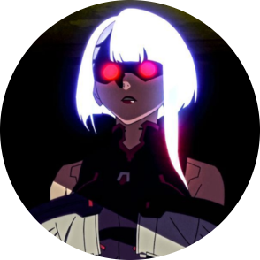

# Home

### Welcome

  

Hi, I’m **Miko Pineda** (**ch1se**), an IT student and passionate cybersecurity enthusiast active on **Hack The Box**. I enjoy solving challenges, exploring offensive security, and learning more about ethical hacking.

Currently, I’ve been focusing more on **OSINT** and **blue teaming**, but I still enjoy jumping into **red teaming** now and then, especially with the seasonal machines on **Hack The Box**.

***

### Get in Touch

Feel free to connect with me or check out my projects on the following platforms:

* [LinkedIn](https://www.linkedin.com/in/miko-pineda/)
* [GitHub](https://github.com/chisedotdev)
