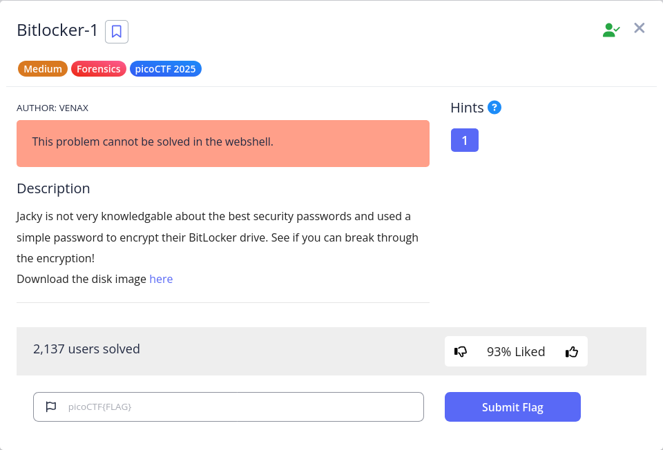
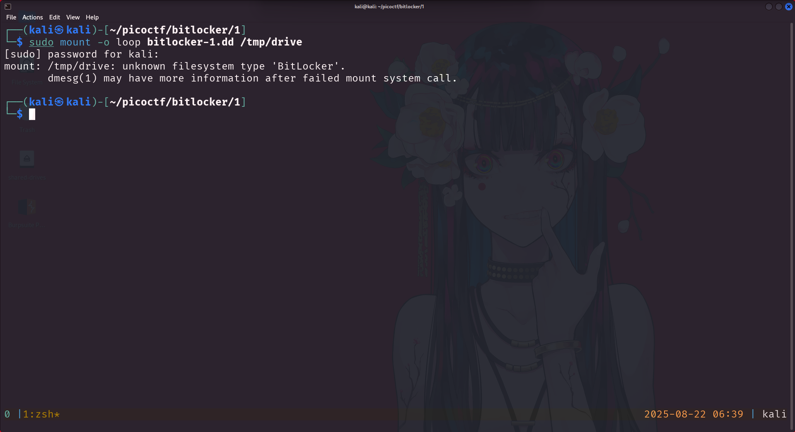
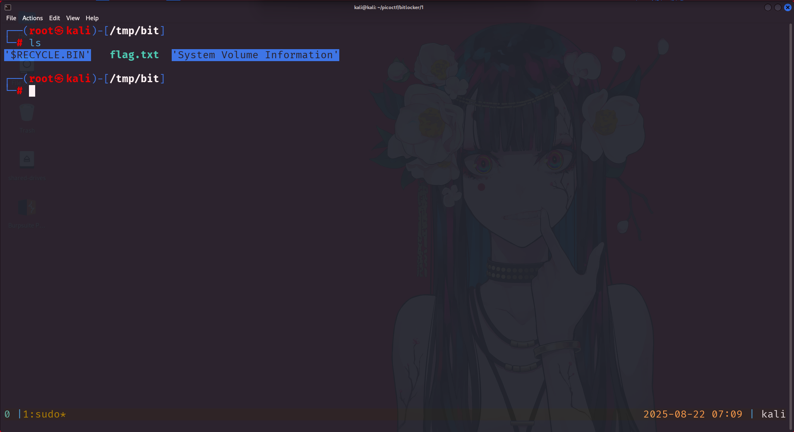

# Bitlocker – Writeup  

## Bitlocker-1

  

#### Overview  

**Challenge Name**: Bitlocker-1  
**Difficulty**: Medium  
**Category**: Forensics  
**Challenge Description**:  
> Jacky is not very knowledgeable about the best security passwords and used a simple password to encrypt their BitLocker drive. See if you can break through the encryption!  

---  

### Steps  

Downloaded the provided disk image file: `bitlocker-1.dd`  

Ran a file check:  

```bash
file bitlocker-1.dd
```  

Result:  

```bash
bitlocker-1.dd: DOS/MBR boot sector, code offset 0x58+2, OEM-ID "-FVE-FS-", sectors/cluster 8, reserved sectors 0, Media descriptor 0xf8, sectors/track 63, heads 255, hidden sectors 124499968, FAT (32 bit), sectors/FAT 8160, serial number 0, unlabeled; NTFS, sectors/track 63, physical drive 0x1fe0, $MFT start cluster 393217, serial number 02020454d414e204f, checksum 0x41462020
```  

The output shows `OEM-ID "-FVE-FS-"`, meaning **Full Volume Encrypted File System** (BitLocker). It also indicates `NTFS`, confirming it’s a Windows disk image.  

Tried mounting it:  

  

Mounting failed. Based on the challenge description, this is about cracking a weak password. A quick search showed [dislocker | Kali Linux Tools](https://www.kali.org/tools/dislocker/) is useful for BitLocker, but a password is still required. Another tool is [john | Kali Linux Tools](https://www.kali.org/tools/john/) with `bitlocker2john`.  

Extracted hash:  

```bash
bitlocker2john -i bitlocker-1.dd > hash
```  

Trimmed to just the **User Password hash**:  

```bash title="hash"
User Password hash:
$bitlocker$0$16$cb4809fe9628471a411f8380e0f668db$1048576$12$d04d9c58eed6da010a000000$60$68156e51e53f0a01c076a32ba2b2999afffce8530fbe5d84b4c19ac71f6c79375b87d40c2d871ed2b7b5559d71ba31b6779c6f41412fd6869442d66d
```  

Cracked it using `john`:  

```bash
john --wordlist=/usr/share/wordlists/rockyou.txt hash
```  

Result:  

```bash
jacqueline       (?)
```  

Password found: `jacqueline`.  

Next, used `dislocker` to decrypt and mount:  

```bash
sudo -s
dislocker bitlocker-1.dd /tmp/drive --user-password=jacqueline
```  

This produced `dislocker-file`. Checked it:  

```bash
file dislocker-file
```  

Result:  

```bash
dislocker-file: DOS/MBR boot sector, code offset 0x52+2, OEM-ID "NTFS    ", sectors/cluster 8, Media descriptor 0xf8, sectors/track 63, heads 255, hidden sectors 124499968, dos < 4.0 BootSector (0x80), FAT (1Y bit by descriptor); NTFS, sectors/track 63, sectors 204799, $MFT start cluster 8533, $MFTMirror start cluster 2, bytes/RecordSegment 2^(-1*246), clusters/index block 1, serial number 0804e24974e2487cc; contains bootstrap BOOTMGR
```  

Created a mount point and mounted it:  

```bash
mkdir /tmp/bit
mount -o loop dislocker /tmp/bit
```  

Result:  

```bash
The disk contains an unclean file system (0, 0).
Metadata kept in Windows cache, refused to mount.
Falling back to read-only mount because the NTFS partition is in an
unsafe state. Please resume and shutdown Windows fully (no hibernation
or fast restarting.)
Could not mount read-write, trying read-only
```  

Despite the warning, the filesystem mounted read-only. Navigating to `/tmp/bit` revealed `flag.txt`:  

  

---  

### Flags  
```
picoCTF{us3_b3tt3r_p4ssw0rd5_pl5!_3242adb1}
```

---

### Summary  

The challenge revolved around recognizing BitLocker encryption (`-FVE-FS-`), extracting the user password hash with `bitlocker2john`, cracking it with `john`, and finally using `dislocker` to mount the decrypted volume. A weak password led directly to the flag.  

---

## Bitlocker-2

> This section is still in progress — I will update it once I finish solving the Bitlocker-2 challenge.