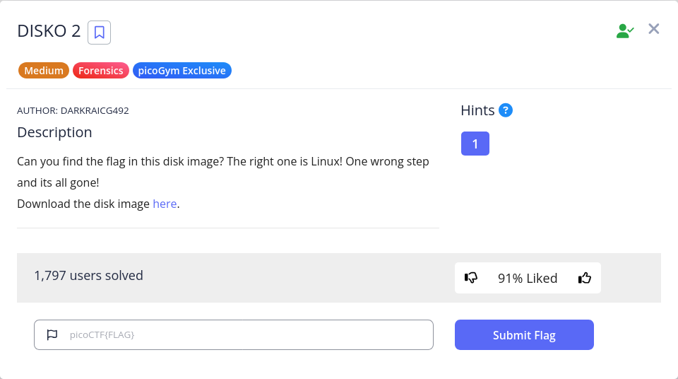

# DISKO 1 to 3 - Writeup

## DISKO 1  


### Overview  

**Challenge Name**: DISKO 1

**Difficulty**: Easy

**Category**: Forensics

**Challenge Description**:
> Can you find the flag in this disk image?

---

### Steps

The provided file `disko-1.dd.gz` is a compressed disk image. The first step is to decompress it to access its contents. This can be done using the `gunzip` command.

```bash
gunzip disko-1.dd.gz
```

Next, the `file` command is used to identify the type of the extracted disk image `disko-1.dd`.

```bash
file disko-1.dd
```

The output reveals that it is a **DOS/MBR boot sector** with a FAT32 file system. While the challenge involves a disk image, a common and efficient first step in forensics challenges is to check if the flag can be found as a plain string within the file. This can be achieved using the `strings` command, which extracts printable characters from a file.

The `strings` command is piped to `grep` to filter for the string "pico," which is a common substring in picoCTF flags.

```bash
strings disko-1.dd | grep -i 'pico'
```

The output of the command is shown below.

```bash
_ZN13QsciScintilla10apiContextEiRiS0_
:/icons/appicon
PICONV
# $Id: piconv,v 2.8 2016/08/04 03:15:58 dankogai Exp $
piconv -- iconv(1), reinvented in perl
  piconv [-f from_encoding] [-t to_encoding]
  piconv -l
  piconv -r encoding_alias
  piconv -h
B<piconv> is perl version of B<iconv>, a character encoding converter
a technology demonstrator for Perl 5.8.0, but you can use piconv in the
piconv converts the character encoding of either STDIN or files
Therefore, when both -f and -t are omitted, B<piconv> just acts
picoCTF{1t5_ju5t_4_5tr1n9_be6031da}
runtime.(*piController).reset
runtime.(*piController).next
type:runtime.piController
type:oDpiCOiQ
```

Analyzing the results, the string `picoCTF{1t5_ju5t_4_5tr1n9_be6031da}` is clearly visible. This is the flag for the challenge. While a full forensic analysis of the disk image could have been performed using tools like `foremost` or `autopsy`, a simple `strings` command was sufficient to solve the challenge.

---

### Flags

```
picoCTF{1t5_ju5t_4_5tr1n9_be6031da}
```

---

### Summary

The challenge `DISKO 1` required us to find the flag within a disk image. The solution was straightforward as the flag was stored as a plain string within the file. We used the `gunzip` command to decompress the provided file and then used the `strings` utility to extract the flag. The `strings` command is often a very effective and fast method to check for flags in binary files and disk images before resorting to more complex forensic tools.

---

## DISKO 2



### Overview

**Challenge Name**: DISKO 2

**Difficulty**: Medium

**Category**: Forensics

**Challenge Description**:
> Can you find the flag in this disk image? The right one is Linux! One wrong step and its all gone!

---

### Steps

The provided file `disko-2.dd.gz` is a compressed disk image. The first step is to decompress it using `gunzip`.

```bash
gunzip disko-2.dd.gz
```

Next, we can examine the file type and partitions using the `file` command.

```bash
file disko-2.dd
```

The output indicates that the disk image contains two partitions, with IDs `0x83` (Linux) and `0xb` (W95 FAT32).

To get a more detailed view of the partitions, we use the `fdisk` utility with the `-l` (list) flag.

```bash
fdisk -l disko-2.dd
```

The `fdisk` output confirms the presence of two partitions, `disko-2.dd1` (Linux) and `disko-2.dd2` (W95 FAT32). The challenge description specifically states, "The right one is Linux! One wrong step and its all gone!" This indicates that we should focus on the Linux partition.

The `strings` command can be used to search for potential flags within the entire disk image.

```bash
strings disko-2.dd | grep -i 'pico'
```

This command returns multiple potential flags, which suggests that the correct flag is not just a simple string but requires us to find it in the correct partition.

To isolate the Linux partition, we can use the `dd` command, which is a powerful tool for copying and converting files, often used for disk imaging. We need to specify the correct parameters based on the `fdisk` output.

```bash
dd if=disko-2.dd of=linux-part.dd bs=512 skip=2048 count=51200
```

* `dd`: The command line utility to copy and convert files.
* `if=disko-2.dd`: Specifies the input file, which is our disk image.
* `of=linux-part.dd`: Specifies the output file where the Linux partition will be written.
* `bs=512`: Sets the block size to 512 bytes, which is the sector size reported by `fdisk`.
* `skip=2048`: Skips 2048 input blocks before starting to copy. This value is the `Start` sector of the Linux partition from the `fdisk` output.
* `count=51200`: Copies 51200 blocks. This value is the `Sectors` count of the Linux partition.

After creating a new disk image containing only the Linux partition, we can run the `strings` command on this isolated partition to find the correct flag.

```bash
strings linux-part.dd | grep -i pico
```

The output now shows a single, correct flag.

---

### Flags

```
picoCTF{4_P4Rt_1t_i5_90a3f3d1}
```

---

### Summary

The challenge required us to extract a flag from a specific partition of a disk image. The disk image contained multiple partitions, and the flag was only present in the Linux partition. We used `fdisk` to analyze the partition table and identify the start and sector count of the Linux partition. We then used the `dd` command to create a new disk image containing only the Linux partition. Finally, the `strings` command was used on this isolated file to retrieve the flag. This process highlights the importance of using the correct forensic tools to navigate and analyze partitioned data, rather than treating the entire disk image as a single file.

---

## DISKO 3


### Overview

**Challenge Name**: DISKO 3

**Difficulty**: Medium

**Category**: Forensics

**Challenge Description**:
> Can you find the flag in this disk image? This time, its not as plain as you think it is!

---

### Steps

The provided file `disko-3.dd.gz` is a compressed disk image. The first step is to decompress it using `gunzip`.

```bash
gunzip disko-3.dd.gz
```

Next, the `file` command is used to identify the type of the extracted disk image `disko-3.dd`.

```bash
file disko-3.dd
```

The output indicates it is a **DOS/MBR boot sector** with a **FAT32** file system. Unlike the previous challenges, a simple `strings` command did not reveal the flag, as the challenge description hints that it's "not as plain as you think it is."

Given that the image contains a file system, the next logical step is to mount the disk image to explore its contents. The `mount` command with the `-o loop` option is used to treat the file as a loop device, allowing it to be mounted like a physical disk.

```bash
sudo mount -o loop disko-3.dd /mnt/drive
```

Once mounted, we can navigate to the mount point, `/mnt/drive`, and list its contents. We find a single directory named `log`. Inside the `log` directory, we find a file named `flag.gz`.

This `.gz` extension indicates that the file is compressed. We use `gunzip` to decompress the file, which results in a file named `flag`.

Finally, we use the `cat` command to view the contents of the `flag` file. The contents of the file reveal the flag.

---

### Flags

```
picoCTF{n3v3r_z1p_2_h1d3_654235e0}
```

---

### Summary

The challenge `DISKO 3` required us to find a flag hidden within a disk image. Initial methods like `strings` proved ineffective, leading us to examine the file system's contents. By mounting the disk image, we were able to navigate its file structure. The flag was not directly visible but was instead hidden within a compressed `.gz` file. This challenge demonstrates that flags are not always in plain text and may require additional steps, such as decompression, to be retrieved.